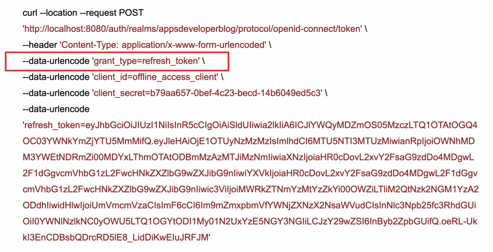

# Refresh Token

Access Token 을 발급받을 때, 함께 받은 Refresh Token으로 Access Token을 다시 발급받는 방식이다. Access Token은 유효기간이 있는데, 보안상의 이유로 짧게 설정하는 편이다. 마찬가지로 Refresh Token 또한 유효기간이 존재하는데, Access Token보다는 길게 설정한다. 그래서 Access Token이 만료되고 Refresh Token이 아직 만료되지 않았다면, 사용자가 인증을 하지 않고 클라이언트가 refresh token으로 Access Token을 새로 발급받을 수 있다.

 

## 인증 흐름

1. 인증을 하고 Access Token을 요청한다.
2. 인증 서버는 Access Token과 Refresh Token을 같이 발급한다.
3. 클라이언트가 Access Token으로 리소스 서버를 경유해서 리소스를 요청한다.
4. 리소스 서버는 Access Token이 유효한지 확인한다.
5. Access Token이 만료되었다면 리소스 서버는 클라이언트에게 유효하지 않은 토큰임을 알린다.
6. 클라이언트는 Refresh Token으로 새로운 Access Token을 인증 서버에게 요청한다.
7. 인증 서버는 Refresh Token을 검증하고, 다시 발급한다. 이때, 인증 서버의 설정에 따라 Refresh Token도 다시 함께 발급받을 수도 있고, Access Token만 발급받을 수도 있다.

 

## Request 메시지

request 메시지 형태는 grant_type이 refresh_toekn이고 refresh_token을 파라미터로 담아 인증 서버로 요청한다.

 

## Refresh Token Expire

Refresh Token은 만료기간을 설정하거나 무제한으로 사용하도록 할 수 있다.

위 그림에서 상위의 fresh token은 만료기간을 1800초 (30분)를 주었지만, 아래에선 무제한으로 설정하였다. 만료기간이 없는 Refresh Token을 발급받고 싶을 땐, Access Token 요청 시, scope에 offline_access를 명시해야 한다. 당연하게도 이 refresh token은 안전하게 보관되어야 한다.

