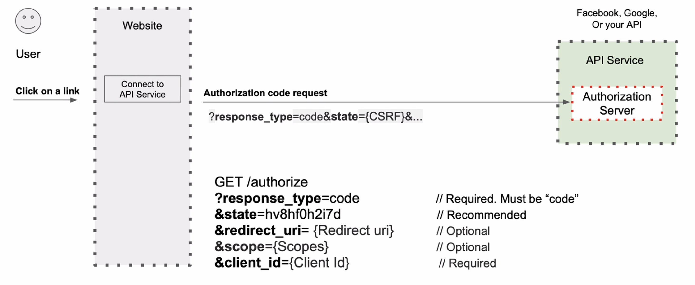
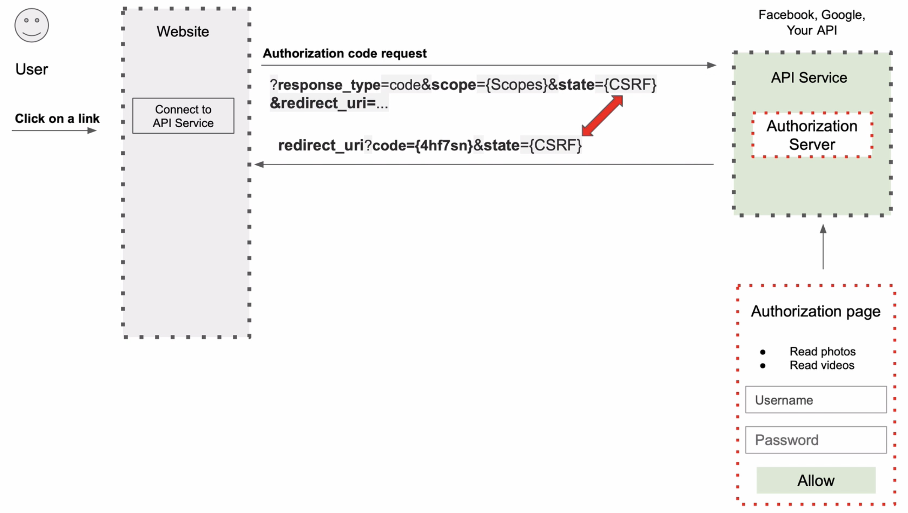
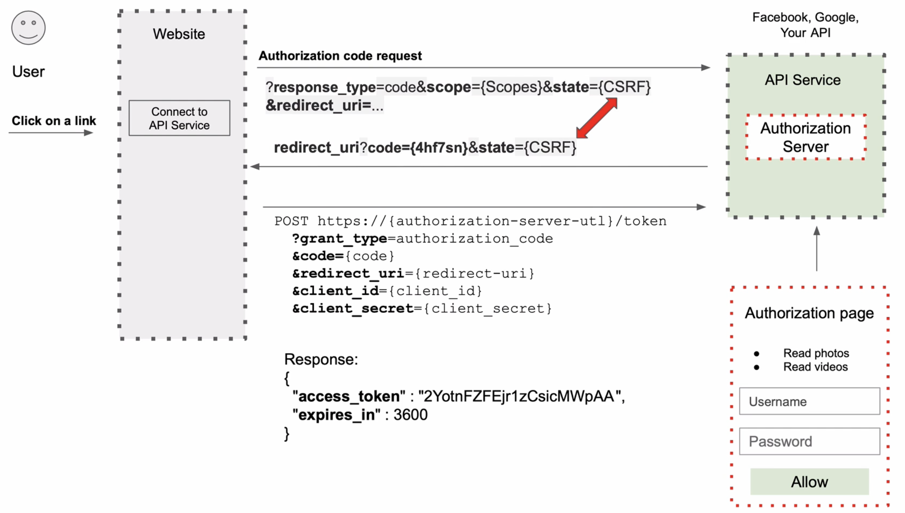

# Authorization Code Grant

인증 코드 방식은 기본적으로 리다이렉션 기반 흐름으로 인증을 한다. 따라서 인증 서버에서 리다이렉션을 처리할 수 있어야 하며, 또한 클라이언트는 클라이언트 암호를 인증 코드를 교환할 때 보내야 한다. 때문에 클라이언트가 클라이언트 암호를 안전하게 보관할 수 없다면 이 방식을 사용하지 말아야하며, 대신 PKC 인증 코드 방식을 사용해야한다. 일반 사용자들이 직접 사용하게 되는 SPA, 모바일 애플리케이션 등이 이에 해당한다. 
이 방식은 일반 사용자가 접근할 수 없는 서버에 안전하게 정보를 보관할 수 있는, 서버 사이드 웹 앱 방식이 유효하다.

## 인증 흐름

### 1. 코드 요청

인증 서버로 인증을 받을수 있는 코드를 요청한다.

* parameter
    * **response_type** : 코드를 요청한다는 것을 인증 서버에 알린다.
    * **state** : 랜덤 문자열을 보내고 서버는 다시 이 문자열을 코드와 함께 response 으로 돌려준다. 이 때 값이 일치해야 하며, 다르다면 다른 flow로 인식한다.
    * **redirect_uri** : 인증 코드를 전달받을 redirect uri
    * **scope** : 권한의 범위이다. 예를 들어, facebook의 사진 파일만 접근할 수 있게 범위를 한정한다.
    * **client_id** : 클라이언트 식별자. 클라이언트가 해당 인증서버로부터 부여받은 ID.

 

### 2. 사용자 로그인

1. 요청 이후에 인증 서버는 사용자에게 로그인 페이지를 제공한다. 
3. 인증 서버는 authorization code(최대 약 10분 정도 유효)와 클라이언트로 받은 state를 redirect_uri로 넘겨준다. authorization code는 한 번만 사용할 수 있다. 
2. 로그인 이후에, 사용자는 클라이언트가 본인을 대신해서 리소스에 접근할 수 있도록 허가를 한다. 

 

### 3. access token 요청

마지막으로 authorization code를 사용해서 access token을 요청한다.

* parameter
    * grant_type : authorization_code 유형을 사용하고 있음을 알린다.
    * code : 리디렉션에 제공된 인증 코드.
    * redirect_uri : 코드를 요청할 때 사용 된 동일한 리디렉션 URI. 필요하지 않을 경우도 있다.
    * client_id : 클라이언트의 고유 식별 값 (유효한 클라이언트임을 인증)
    * client_secret : 클라이언트 비밀키 (유효한 클라이언트임을 인증)

 

## Flow 요약

1. 유저는 웹사이트에 로그인을 시도한다.
2. 웹사이트는 인증 서버로 코드를 요청한다.
3. 인증 서버는 사용자에게 로그인 페이지를 제공한다.
4. 유저가 로그인을 한다.
5. 인증 서버는 사용자에게 웹 사이트가 유효한 사이트인지 묻는 동의 페이지를 제공한다.
6. 사용자는 웹 사이트가 유효함을 알린다.
7. 인증 서버는 Authorization code를 리디렉션 uri로 전달한다.
8. 클라이언트는 전달받은 Authorization code와 클라이언트 정보를 사용해서 access token을 요청한다.
9. 인증 서버는 access token과 refresh token을 보내준다.
10. 클라이언트는 access token으로 리소스 서버의 api를 통해 리소스에 접근한다.
11. 리소스 서버는 인증 서버에 access token이 유효한 토큰인지 확인 요청한다.
12. 인증 서버는 리소스 서버에게 유효한 토큰임을 알린다.
13. 리소스 서버는 이후 요청에 대한 작업을 진행시키고 웹 사이트로 결과를 보낸다.