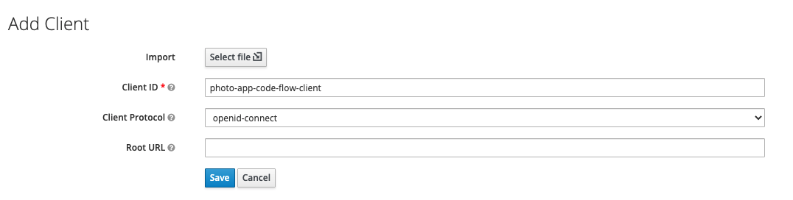
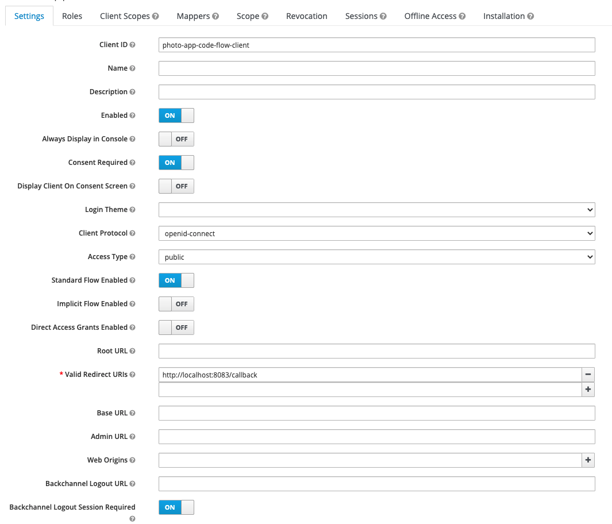
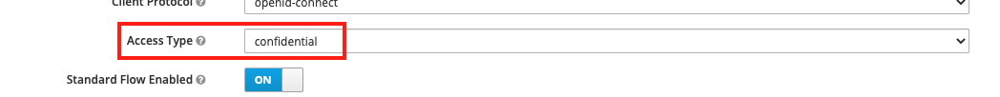
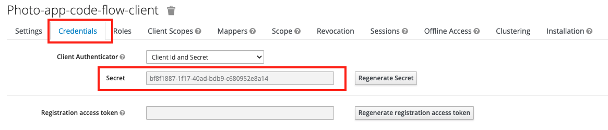

# Client

## 클라이언트 생성

### 1. 생성

 

위의 그림과 같이 Client 메뉴에서 Create버튼을 클릭하고, Add Client 페이지에서 Client ID를 부여하고 생성한다.

  

### 2. 설정

생성하고나면 위와 같은 설정 페이지로 이동하게 하는데, 기본적으로 Authorization Code Grant 유형으로 설정되어 있다. 

* 중요 설정

    * Client ID : 인증에 사용될 클라이언트 ID
    * Enabled : 사용 여부
    * Access Type : 클라이언트의 접근 방식
        * public : 공용 클라이언트(비밀키를 안전하게 보관할 수 없음)
        * confidential : 기밀 클라이언트(비밀키를 안전하게 보관)
    * Standard Flow Enabled : Standard Authorization Code Grant type 사용 여부
    * Direct Access Grants Enabled : Password Grant type 사용 여부
    * Valid Redirect URIs : 사용자가 인증 후에 redirect할 수 있는 URL 모음
    * Service Accounts Enabled(기밀 클라이언트일 때) : Client Credentials Grant type 사용 여부

 

* PKCE 설정

PKCE code 교환 방식을 사용하기 위해서는 Client 설정 페이지 아래의 Advanced Settings 영역에서 Key 암호화 방식을 설정해줘야 한다.

`Proof Key for Code Exchange Code Challenge Method`에서 암호화 방식을 선택한다. 처음엔 빈 값으로 설정이 되어있는데, 암호화 방식을 지정해주지 않으면 사용할 수 없다.

  

## 클라이언트 비밀키 생성

### 1. Access Type 변경

비밀키를 생성하려면 Access Type을 public이 아니라 confidential로 설정해야 한다.

### 2. 비밀키 확인

상단의 Tab에 Credentials가 생성되고, Secret가 생성되어 있는것을 확인할 수 있다.

