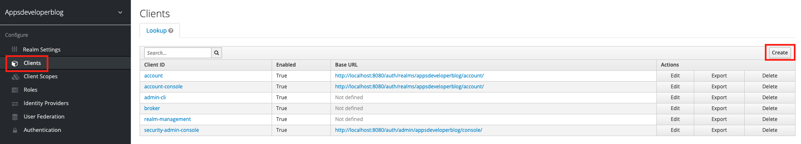

# Client

## 클라이언트 생성

### 1. 생성

 

위의 그림과 같이 Client 메뉴에서 Create버튼을 클릭하고, Add Client 페이지에서 Client ID를 부여하고 생성한다.

  

### 2. 설정

생성하고나면 위와 같은 설정 페이지로 이동하게 하는데, 기본적으로 Authorization Code Grant 유형으로 설정되어 있다. 

* 중요 설정

    * Client ID : 인증에 사용될 클라이언트 ID
    * Enabled : 사용 여부
    * Access Type : 클라이언트가 공용 클라이언트인지 여부(비밀키를 안전하게 보장할 수 있는지)
    * Standard Flow Enabled : Standard Authorization Code Grant type 사용 여부
    * Direct Access Grants Enabled : Password Grant type 사용 여부
    * Valid Redirect URIs : 사용자가 인증 후에 redirect할 수 있는 URL 모음

  

## 클라이언트 비밀키 생성

### 1. Access Type 변경

비밀키를 생성하려면 Access Type을 public이 아니라 confidential로 설정해야 한다.

### 2. 비밀키 확인

상단의 Tab에 Credentials가 생성되고, Secret가 생성되어 있는것을 확인할 수 있다.

