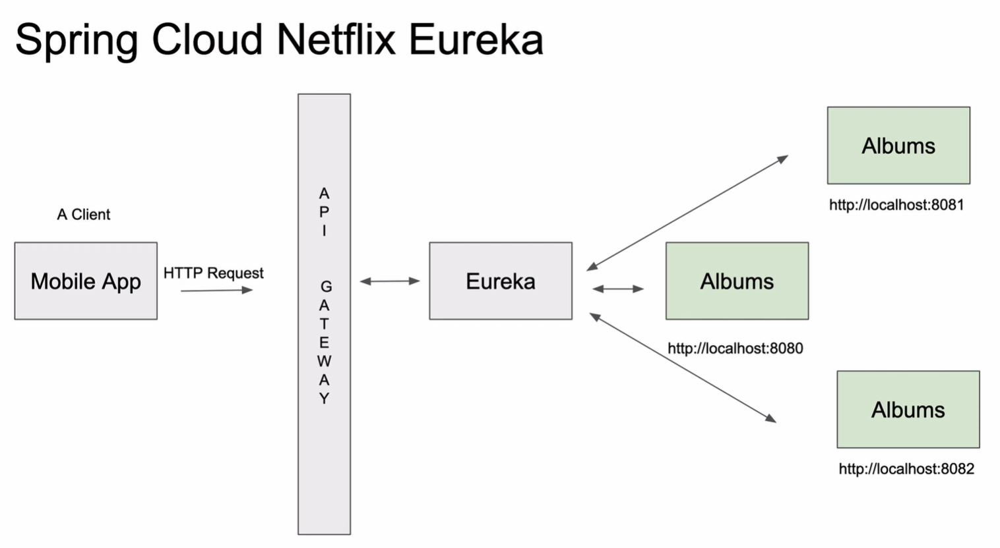

# Spring Cloud Netflix Eureka

넷플릭스는 MSA의 선두주자로서 MSA의 도입 노하우와 코드를 공유하여 오픈소스화 하였다. 이것들 넷플리스 OSS(Open Source Software) 라고 하는데, Eureka는 이 넷플릭스 OSS에 포함된 스펙 중 하나이다. 
  
서비스가 커지고 사용가 많아지면서 트래픽 부하가 일어날 때, MSA 구조에서는 수평확장을 하게 된다. 수평확장을 해서 인스턴스가 늘어나게되면 관리가 필요하게 되는데, 추가된 인스턴스를 사용하는 서비스에서 이것을 알아야할 테고, 로드밸런싱을 사용하고 있다면 그것에 대한 처리가 필요할 것이다. 그리고 트래픽이 들쭉날쭉해서 인스턴스의 삭제와 추가가 빈번하다면 관리하기가 더 어렵게 된다.
  
이 때 필요한 기술이 인스턴스의 상태를 동적으로 관리해주는 기술인데, 이런 역할을 하는 서버를 서비스 디스커버리 서버(Service Discovery Server)라고도 하며, 그 중 하나가 Eureka이다.
  
Netflix OSS는 SpringBoot를 통한 자동 구성 및 스프링 기반의 프로그래밍 모델을 통해서 구축할 수 있도록 Spring Cloud Netflix 프로젝트 속해 있으며, Eureka는 그 중 하나의 기능으로서 포함되어 있다.

<kbd></kbd>

위의 그림에서 Albums 리소스 서버가 3개가 있는데, 모두 Eureka 서버와 연결되어 있다. SpringBoot로 인스턴스를 추가할 때, 설정을 통해 Eureka 정보를 설정한다. 그러면 Eureka 서버에 스스로 ip와 포트 정보등을 전송하고, Eureka 서버는 이를 저장해 놓는다. 이후, Eureka 주기적으로 인스턴스의 상태를 체크해서 인스턴스가 실행중이 아니라면 저장해놓은 인스터스 정보를 삭제한다.
  
Eureka는 다른 Eureka 서버에 인스턴스로서 등록될 수도 있다. 그래서, Euraka는 서버인 동기에 클라이언트도 될 수 있으며, 
  
그럼 Albums 서비스를 사용해야 하는 다른 서비스들은 Eureka에서 인스턴스 정보를 검색하고 이용할 수 있다. 그리고 보통은 위의 그림과같이 API Gateway에서 Eureka에 저장된 인스턴스 정보를 검색하고 요청을 보내는 방식으로 사용되며, API Gateway는 검색한 인스턴스 정보들을 바탕으로 로드밸런싱을 수행하기도 한다.